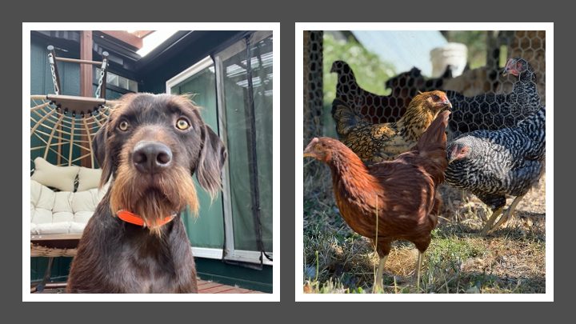
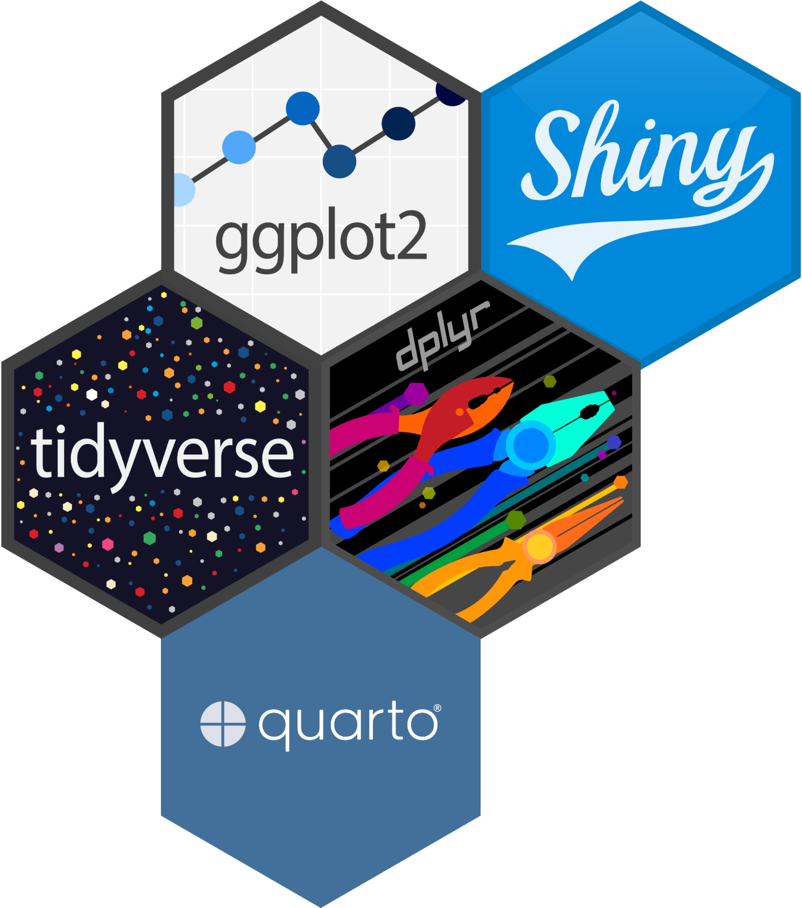
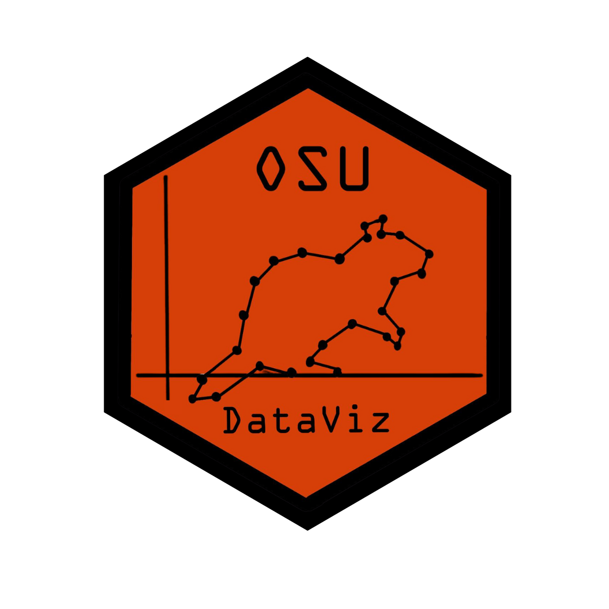

```{r echo=FALSE}
library(countdown)
```

## Welcome to ST 437!

### I'm glad you're here!

::: nonincremental
-   Please find a seat at one of the blue cards.
-   Write your (preferred) name on the card.
-   We'll get started at 4 pm!
:::

## Who are we?

### Erin Howard (she/her)

:::::: columns
:::: {.column width="40%"}
::: nonincremental
-   A Hokie & a Beaver
-   Skier, baker, & soccer player
-   Statistics education enthusiast
-   Dog lover and chicken care taker
:::
::::

::: {.column width="60%"}
{width="511"}
:::
::::::


## Who are you?

### Brief introductions

Tell us...

::: nonincremental
-   Your name (what you preferred to be called)
-   Your major
-   Why you're taking this class
-   Something that excites you or that you're passionate about (this can be academic or person)
-   Anything else we should know about you?
:::

## What's ST 437 All About?

### Learning Outcomes

::: nonincremental
-   Critique a visualization based on its purpose and use or abuse of perceptual principles.
-   Propose improvements to a visualization to enhance its effectiveness.
-   Combine tools for data manipulation and visualization to collect, tidy, and manipulate data to create visualizations to answer questions of interest.
-   Polish a visualization to publication-ready standards.
-   Create data visualizations that incorporate ethical considerations.\
:::

## What's ST 437 All About?

### 

| Week | Topic                                         |
|------|-----------------------------------------------|
| 1    | Intro to Data Viz                             |
| 2    | Data Manipulation & Tidying                   |
| 3    | Fundamentals of Visual Encoding               |
| 4    | Refining Visualizations & Graphical Integrity |
| 5    | Communication with Visualizations             |
| 6    | Advanced Visualization Tools & Customization  |
| 7    | Presentation & Reproducibility                |
| 8    | Case Studies & Critique                       |
| 9    | Project Work & Polishing Visualizations       |
| 10   | Presentations                                 |

## General Course Structure


+--------------------------+----------------------------------+
| Tuesdays (Weeks 1-9)     | Thursdays (Weeks 1-9)            |
+==========================+==================================+
| *A bit more conceptual*  | *A bit more applied*             |
|                          |                                  |
| Lectures and discussions | Lab activity - bring your laptop |
+--------------------------+----------------------------------+

### Beginning Week 2

Each class period will begin with **Data Viz in the News**


### Week 10

Tuesday: Final Symposium Prep

Thursday: Final Symposium


## Update or Download R and RStudio

Instructions for downloading and updating R and RStudio can be found in the Getting Started module on Canvas.

{fig-align="center" width="295"}

Please bring a laptop with R and RStudio downloaded to class on Thursday.

 

*If you need assistance obtaining a loaner laptop for the term, please speak with Erin privately ASAP.*

## Course Logo Contest

:::::: columns
::: column
{width="345"}


:::

:::: column
::: nonincremental
-   Design a hex sticker logo for our class!
-   You can do this alone or with others.
-   Submissions will be due on Friday, May 15.
-   We'll vote on our favorite. The winning design will be made into hex stickers!
:::
{width="345"}
::::
::::::
